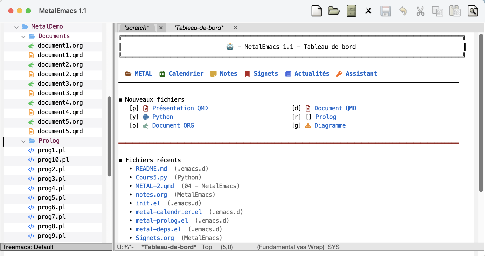
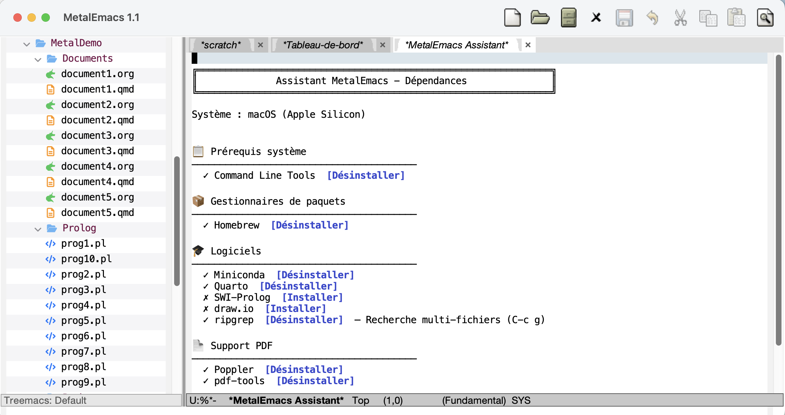

# MetalEmacs

**MetalEmacs** est une distribution Emacs personnalisée et multiplateforme, conçue à l'origine pour les étudiants de mes cours en traitement automatique du langage (TAL) à l'Université Laval. *Metal* est l'acronyme de **M**on **E**nvironnement pour le **T**raitement **A**utomatique du **L**angage.

J'ai assemblé un ensemble de paquets Emacs (*packages*) qui couvrent toutes les tâches requises pour la réalisation d'un projet ou d'une étude de cas en TAL :

- Analyse, observation et annotation de textes
- Prise de notes
- Programmation en Python et Prolog
- Installation d'un environnement Python préconfiguré pour le TAL
- Création de diagrammes
- Rédaction d'un rapport technique (en Org-mode ou Quarto)
- Préparation de présentations

 
*Tableau de bord à l'ouverture : accès rapide aux fonctions principales et aux fichiers récents.*

Le tout est organisé dans une interface unifiée qui comprend :

- **Tableau de bord**
- **Explorateur de fichiers** (Treemacs)
- **Assistant d'installation interactif** pour les outils externes
- **Visualisation PDF** intégrée
- **Calendrier** avec import ICS
- **Synchronisation iOS** d'Org-mode via Beorg
- **Mises à jour automatiques**

## Plateformes supportées

- **macOS** (Apple Silicon et Intel)
- **Windows 10/11**
- **Linux/ChromeOS** (Debian/Ubuntu)

## Prérequis communs

Quelle que soit la plateforme, MetalEmacs nécessite :

- **Emacs 29 ou plus récent**
- **Git** (pour le clonage et les mises à jour)
- Environ **2 Go d'espace disque** (paquets Emacs, environnement Python, outils TeX)
- Une connexion Internet pour le premier démarrage (5 à 15 minutes selon la bande passante)

Les outils additionnels (Homebrew, Miniconda, Poppler, etc.) sont gérés par l'**Assistant d'installation** intégré, présenté plus bas.

## Installation

### macOS

> **Note** : sur macOS, la touche `Option` correspond à `M` dans Emacs (par exemple `M-x` = `Option-x`).

1. Télécharger et installer **Emacs pour macOS** depuis <https://emacsformacosx.com/>
2. Ouvrir un Terminal et cloner MetalEmacs :
   ```bash
   git clone https://github.com/JacquesLadouceur/metalemacs.git ~/.emacs.d
   ```
   Si Git n'est pas installé, macOS proposera d'installer les **outils de ligne de commande Xcode** — accepter.
3. Lancer Emacs (premier démarrage : 5 à 15 minutes pour le téléchargement des paquets)
4. **À la question sur la compilation de `pdfinfo`, répondre non.**
5. Une fois le démarrage terminé, ouvrir l'**Assistant** et installer dans l'ordre :
   - Homebrew
   - Poppler
   - pdf-tools

### Windows

> **Note** : sur Windows, la touche `Alt` correspond à `M` dans Emacs (par exemple `M-x` = `Alt-x`).

1. Télécharger et installer **Emacs** depuis <https://ftp.gnu.org/gnu/emacs/windows/> (choisir le sous-dossier de la dernière version et lancer le fichier `emacs-XX.X-installer.exe`)

2. Ouvrir un terminal et exécuter les commandes selon le shell utilisé :

   - Avec **Windows PowerShell** :
     ```powershell
     winget install --id Git.Git -e --source winget
     setx HOME $env:USERPROFILE
     ```
   - Avec l'**Invite de commandes** (*Command Prompt*) :
     ```cmd
     winget install --id Git.Git -e --source winget
     setx HOME %USERPROFILE%
     ```

3. **Fermer puis rouvrir** le terminal pour que Git et la nouvelle variable `HOME` soient disponibles, puis cloner MetalEmacs :

   - Avec **Windows PowerShell** :
     ```powershell
     git clone https://github.com/JacquesLadouceur/metalemacs.git $HOME\.emacs.d
     ```
   - Avec l'**Invite de commandes** (*Command Prompt*) :
     ```cmd
     git clone https://github.com/JacquesLadouceur/metalemacs.git %HOME%\.emacs.d
     ```


4. Démarrer Emacs (premier démarrage : 5 à 15 minutes)
5. Une fois le démarrage terminé, ouvrir l'**Assistant** et installer :
   - Scoop

### ChromeOS / Linux

> **Note** : sur Linux/ChromeOS, la touche `Alt` correspond à `M` dans Emacs (par exemple `M-x` = `Alt-x`).

1. Sur Chromebook : activer l'environnement Linux dans **Paramètres → À propos de ChromeOS → Développeurs**
2. Ouvrir le Terminal et installer les prérequis (un seul copier-coller) :
   ```bash
   sudo apt update && sudo apt upgrade -y
   echo "deb http://deb.debian.org/debian bookworm-backports main" \
       | sudo tee /etc/apt/sources.list.d/backports.list
   sudo apt update
   sudo apt install -y -t bookworm-backports emacs
   sudo apt install -y git curl fonts-noto fonts-firacode fonts-hack \
       build-essential libpng-dev zlib1g-dev \
       libpoppler-glib-dev libpoppler-private-dev
   ```
3. Cloner MetalEmacs :
   ```bash
   git clone https://github.com/JacquesLadouceur/metalemacs.git ~/.emacs.d
   ```
4. Lancer Emacs depuis le lanceur d'applications
5. **À la question sur la compilation de `pdfinfo`, répondre non.**
6. Une fois le démarrage terminé, ouvrir l'**Assistant** et installer :
   - Poppler (si disponible)
   - pdf-tools

### L'Assistant d'installation

L'**Assistant** détecte automatiquement la plateforme et l'état de chaque dépendance. Il suffit de cliquer pour installer ou désinstaller — aucune commande shell à taper.


*Assistant d'installation : détection automatique des dépendances, installation en un clic et adaptation à la plateforme (ici macOS Apple Silicon).*

## Mise à jour

Depuis Emacs (recommandé) :

```
M-x metal-git-mise-a-jour
```

Ou en ligne de commande :

```bash
cd ~/.emacs.d           # Sous Windows : cd %HOME%\.emacs.d
git pull
```

Redémarrer ensuite Emacs ; les nouveaux paquets seront téléchargés automatiquement au besoin.

## Modules

| Module                  | Rôle                                              |
|-------------------------|---------------------------------------------------|
| `metal-toolbar.el`      | Primitives de barre d'outils header-line          |
| `metal-pdf.el`          | Visualisation et impression de PDF                |
| `metal-python.el`       | Environnement Python, REPL IPython, gestion Conda |
| `metal-prolog.el`       | Environnement SWI-Prolog avec pliage et tracing   |
| `metal-org.el`          | Org-mode étendu, drag-and-drop, sync Beorg        |
| `metal-beorg.el`        | Synchronisation iOS d'Org-mode via Beorg/iCloud   |
| `metal-quarto.el`       | Édition Quarto, gestion TinyTeX                   |
| `metal-calendrier.el`   | Calendrier calfw avec import ICS                  |
| `metal-deps.el`         | Assistant d'installation des dépendances          |
| `metal-distribution.el` | Mises à jour cloud                                |
| `metal-dashboard.el`    | Tableau de bord d'accueil                         |
| `metal-treemacs.el`     | Explorateur de fichiers                           |
| `metal-securite.el`     | Corbeille interne avec restauration               |

## Signalement de problèmes

Pour les bugs ou suggestions, ouvrir une [issue](https://github.com/JacquesLadouceur/metalemacs/issues).

## Licence

Copyright © 2023–2026 Jacques Ladouceur — distribué sous licence GPL v3.

## Auteur

**Jacques Ladouceur**
[jacques.ladouceur@gmail.com](mailto:jacques.ladouceur@gmail.com)
