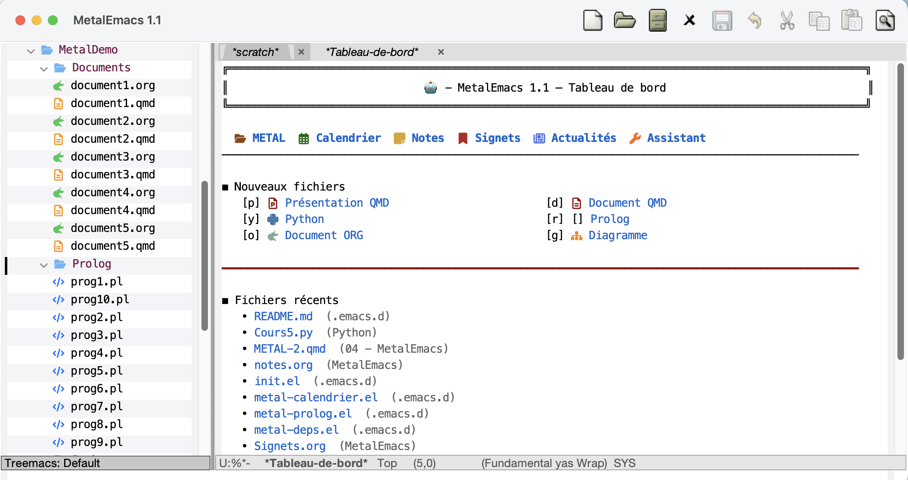
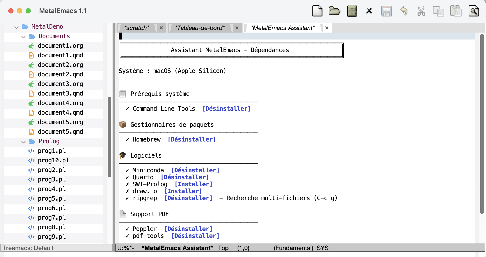

# MetalEmacs

**MetalEmacs** est une distribution Emacs personnalisée et multiplateforme, conçue à l'origine pour les étudiants de mes cours en traitement automatique du langage (TAL) à l'Université Laval. *Metal* est l'acronyme de **M**on **E**nvironnement pour le **T**raitement **A**utomatique du **L**angage.

J'ai assemblé un ensemble de paquets Emacs (*packages*) qui couvrent toutes les tâches requises pour la réalisation d'un projet ou d'une étude de cas en TAL :

- Analyse, observations et annotations de textes
- Prise de notes
- Programmation en Python et Prolog
- Installation d'un environnement Python préconfiguré pour le TAL
- Création de diagrammes
- Rédaction d'un rapport technique (en Org-mode ou Quarto)
- Préparation de présentations
- Assistance par agents IA, intégrée aux barres d'outils


*Tableau de bord à l'ouverture : accès rapide aux fonctions principales et aux fichiers récents.*

Le tout est organisé dans une interface unifiée qui comprend :

- **Tableau de bord**
- **Explorateur de fichiers** (Treemacs)
- **Assistant d'installation interactif** pour les outils externes
- **Agents IA**
- **Visualisation et annotation de documents PDF** intégrées
- **Calendrier** avec import ICS
- **Synchronisation iOS** d'Org-mode via Beorg
- **Mises à jour automatiques**

## Plateformes supportées

- **macOS Ventura (13)** ou plus récent — Apple Silicon et Intel
- **Windows 10/11**
- **Linux/ChromeOS** (Debian/Ubuntu)

## Prérequis communs

Quelle que soit la plateforme, MetalEmacs nécessite :

- **Emacs 29 ou plus récent**
- **Git** (pour le clonage et les mises à jour)
- Environ **2 Go d'espace disque**
- Une connexion Internet pour le premier démarrage (5 à 15 minutes selon la bande passante)

> [!IMPORTANT]
> **Laisser l'Assistant installer les outils qu'il gère.** Un outil déjà installé par une autre voie — site de l'éditeur, `winget`, Chocolatey — ne se trouve pas à l'emplacement attendu par l'Assistant. Bien que celui-ci le *détecte* et l'affiche comme installé, il ne retrouve pas ensuite les composants nécessaires. Le cas se pose surtout sous Windows avec **MSYS2** et **Quarto**.
>
> Cet avertissement ne vise pas Emacs ni Git : ce sont des prérequis à installer avant MetalEmacs, par les commandes ci-dessous.

> [!NOTE]
> **Si `.emacs.d` existe déjà**, le clonage échouera. Sauvegarder puis supprimer le répertoire existant avant de continuer :
> ```bash
> mv ~/.emacs.d ~/.emacs.d.bak      # Windows : Rename-Item $HOME\.emacs.d .emacs.d.bak
> ```

## Installation

### macOS

> [!NOTE]
> Sur macOS, la touche `Option` correspond à `M` dans Emacs (par exemple `M-x` = `Option-x`).

1. Dans le Terminal, installer Homebrew :

   ```bash
   /bin/bash -c "$(curl -fsSL https://raw.githubusercontent.com/Homebrew/install/HEAD/install.sh)"
   ```

   - Accepter d'installer les **outils de ligne de commande Xcode**.
   - À la fin, suivre les instructions affichées (section *Next steps*) pour ajouter Homebrew au `PATH`, puis **fermer et rouvrir** le Terminal.

2. Installer Emacs :

   ```bash
   brew tap d12frosted/emacs-plus
   brew install --cask emacs-plus-app
   ```

   > [!TIP]
   > Depuis Homebrew 6.0, les dépôts non officiels doivent être approuvés. Si l'installation signale un *untrusted tap*, exécuter `brew trust d12frosted/emacs-plus` puis reprendre la commande.

3. Cloner MetalEmacs :

   ```bash
   git clone https://github.com/JacquesLadouceur/metalemacs.git ~/.emacs.d
   ```

4. Lancer Emacs (premier démarrage : 5 à 15 minutes pour le téléchargement des paquets).

5. Une fois le démarrage terminé, ouvrir l'**Assistant** et installer les outils dont vous aurez besoin :
   - Miniconda (pour la programmation en Python)
   - SWI-Prolog
   - Poppler, pdf-tools et serveur epdfinfo (pour l'annotation de documents PDF)
   - etc.

### Windows

> [!NOTE]
> Sur Windows, la touche `Alt` correspond à `M` dans Emacs (par exemple `M-x` = `Alt-x`).

1. Ouvrir PowerShell et exécuter ces commandes une à la fois :

   ```powershell
   winget install -e --id GNU.Emacs
   winget install -e --id Git.Git
   [Environment]::SetEnvironmentVariable('HOME', $env:USERPROFILE, 'User')
   ```

2. **Fermer et rouvrir PowerShell**, puis cloner MetalEmacs :

   ```powershell
   git clone https://github.com/JacquesLadouceur/metalemacs.git $HOME\.emacs.d
   ```

3. Démarrer Emacs (premier démarrage : 5 à 15 minutes).

4. Une fois le démarrage terminé, ouvrir l'**Assistant** et installer les outils dont vous avez besoin :
   - Scoop — gestionnaire de paquets, prérequis de tout le reste
   - Miniconda (pour la programmation en Python)
   - SWI-Prolog
   - MSYS2 et serveur epdfinfo (pour l'annotation de documents PDF)
   - etc.

> [!NOTE]
> Pendant l'installation de **MSYS2**, MetalEmacs procède à son premier démarrage, qui crée le trousseau de signatures de `pacman`. L'opération prend une à deux minutes sans qu'aucune fenêtre ne s'ouvre : c'est normal, il ne faut pas l'interrompre. La console de l'Assistant indique quand elle est terminée.

> [!TIP]
> **Si `winget` répond que le paquet est déjà installé** alors qu'Emacs a été désinstallé, c'est qu'une entrée de désinstallation est restée dans le registre. Le plus simple est de forcer l'installation :
> ```powershell
> winget install -e --id GNU.Emacs --force
> ```

### ChromeOS / Linux

> [!NOTE]
> Sur Linux/ChromeOS, la touche `Alt` correspond à `M` dans Emacs (par exemple `M-x` = `Alt-x`).

1. **Sur Chromebook seulement** :
   - Activer Linux dans **Paramètres → À propos de ChromeOS → Développeurs**
   - Configurer le clavier dans **Paramètres → Appareil → Clavier** :
     - cocher *Traiter les touches de la rangée supérieure comme touches de fonction* (sinon F1–F12 nécessitent la touche Lanceur)
     - remapper *Lanceur* sur *Ctrl* (recommandé pour Emacs)

2. Ouvrir le Terminal et vérifier la version de la distribution :

   ```bash
   cat /etc/debian_version    # ou : lsb_release -ds
   ```

3. Installer les prérequis. **Choisir la commande selon le résultat obtenu** :

   - **Debian 12 (Bookworm)** — Emacs 28 seulement dans le dépôt principal, les *backports* sont donc requis :
     ```bash
     sudo apt update && sudo apt upgrade -y
     echo "deb http://deb.debian.org/debian bookworm-backports main" \
         | sudo tee /etc/apt/sources.list.d/backports.list
     sudo apt update
     sudo apt install -y -t bookworm-backports emacs
     sudo apt install -y git curl fonts-noto fonts-firacode fonts-hack \
         build-essential libpng-dev zlib1g-dev \
         libpoppler-glib-dev libpoppler-private-dev
     ```

   - **Debian 13 (Trixie) ou Ubuntu 24.04+** — Emacs 30 est dans le dépôt principal, aucun *backport* nécessaire :
     ```bash
     sudo apt update && sudo apt upgrade -y
     sudo apt install -y emacs git curl fonts-noto fonts-firacode fonts-hack \
         build-essential libpng-dev zlib1g-dev \
         libpoppler-glib-dev libpoppler-private-dev
     ```

   Vérifier ensuite que la version installée est bien 29 ou plus récente :

   ```bash
   emacs --version | head -1
   ```

4. Cloner MetalEmacs :

   ```bash
   git clone https://github.com/JacquesLadouceur/metalemacs.git ~/.emacs.d
   ```

5. Lancer Emacs depuis le lanceur d'applications.

6. Une fois le démarrage terminé, ouvrir l'**Assistant** et installer :
   - Poppler (si disponible)
   - pdf-tools

### L'Assistant d'installation

L'**Assistant** détecte automatiquement la plateforme et l'état de chaque dépendance. Il suffit de cliquer pour installer ou désinstaller — aucune commande shell à taper.


*Assistant d'installation : détection automatique des dépendances, installation en un clic et adaptation à la plateforme.*

Chaque installation s'affiche dans une **console** au bas de la fenêtre, dont la sortie défile en temps réel. Fermer l'onglet de la console referme sa fenêtre.

Le bouton **Rafraîchir** relit l'état réel du système. C'est lui qu'il faut utiliser après avoir installé quelque chose hors de MetalEmacs, ou après avoir terminé un installateur qui s'ouvre dans sa propre fenêtre — celui de Node.js sur macOS, par exemple.

### Les agents IA

L'Assistant gère aussi l'installation et l'authentification d'agents IA — **Claude**, **ChatGPT** et **Antigravity**.

Ces agents ne s'utilisent pas en ligne de commande : une fois installés, ils s'emploient depuis la **barre d'outils**, par des boutons dont les actions s'adaptent au mode du tampon courant. Les modifications que l'agent propose à un fichier sont soumises à révision avant d'être appliquées.

Chacun exige un compte auprès de son propre fournisseur, et pour certains un abonnement payant : MetalEmacs installe la CLI et gère l'authentification, mais ne fournit aucun accès. L'Assistant affiche pour chaque agent son état d'authentification et ses conditions d'accès.

Un agent est désigné comme **agent par défaut au démarrage** ; le cercle ◯ en début de ligne permet d'en changer. Le bouton **+ Ajouter un autre agent…** ouvre un formulaire pour déclarer une CLI absente du catalogue.

## Mise à jour

Depuis Emacs (recommandé) :

```
M-x metal-git-mise-a-jour
```

Ou en ligne de commande :

```bash
cd ~/.emacs.d           # Sous Windows (PowerShell) : cd $HOME\.emacs.d
git pull
```

Redémarrer ensuite Emacs ; les nouveaux paquets seront téléchargés automatiquement au besoin.

## Modules

| Module                  | Rôle                                                           |
|-------------------------|----------------------------------------------------------------|
| `metal-toolbar.el`      | Primitives de barre d'outils header-line                       |
| `metal-icones.el`       | Rendu couleur des icônes, identique sur toutes les plateformes  |
| `metal-pdf.el`          | Visualisation et impression de PDF                             |
| `metal-pdf-serveur.el`  | Serveur epdfinfo : installation et accord des versions         |
| `metal-python.el`       | Environnement Python, REPL IPython, gestion Conda              |
| `metal-prolog.el`       | Environnement SWI-Prolog avec pliage et tracing                |
| `metal-org.el`          | Org-mode étendu, drag-and-drop, sync Beorg                     |
| `metal-beorg.el`        | Synchronisation iOS d'Org-mode via Beorg/iCloud                |
| `metal-quarto.el`       | Édition Quarto, gestion TinyTeX                                |
| `metal-calendrier.el`   | Calendrier calfw avec import ICS                               |
| `metal-deps.el`         | Assistant d'installation des dépendances et des agents IA      |
| `metal-agent.el`        | Agents IA : dialogue et révision des modifications proposées   |
| `metal-git.el`          | Mise à jour depuis GitHub (`M-x metal-git-mise-a-jour`)        |
| `metal-distribution.el` | Mises à jour cloud                                             |
| `metal-dashboard.el`    | Tableau de bord d'accueil                                      |
| `metal-treemacs.el`     | Explorateur de fichiers                                        |
| `metal-securite.el`     | Corbeille interne avec restauration                            |

## Signalement de problèmes

Pour les bugs ou suggestions, ouvrir une [issue](https://github.com/JacquesLadouceur/metalemacs/issues).

## Licence

Copyright © 2023–2026 Jacques Ladouceur — distribué sous licence GPL v3.

## Auteur

**Jacques Ladouceur**
[jacques.ladouceur@gmail.com](mailto:jacques.ladouceur@gmail.com)
